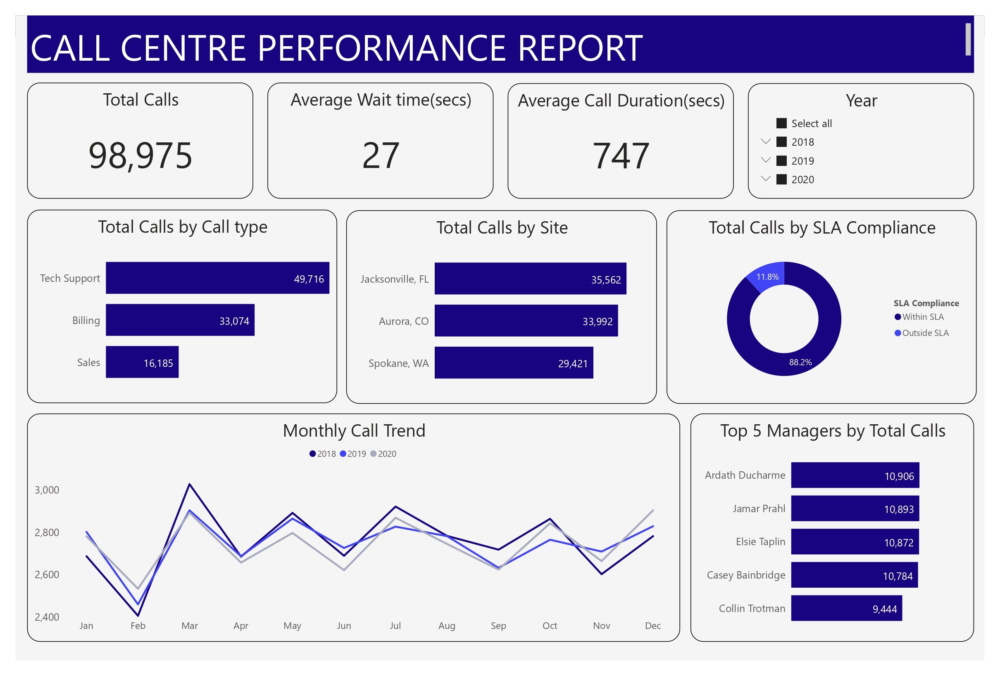

# Edna's Call Centre Analysis

## Introduction

This is a powerbi analysis of an imaginary call centre, **EDNA’s Call Centres** is preparing a strong push into the market and is seeking to expand its business with the opening of new offices across the region. The project analyses the overall services provided by EDNA to derive insights that'll enable its senior management have a better view of its operations 

## Problem Statement

1. Prepare a report that summarise the overall service provided by EDNA’s Call Centres.
2. Delete a column in the Calls data files named “Call Abandoned”
3. Create a new column in the Calls data files, name it “SLA Compliance” This column includes a logical statement wherein Calls “Waittime” is less than 35 seconds . Column results must be “Within SLA” or “Outside SLA”

## Data sourcing

The dataset was downloaded from Maven Analytics Website. It contains:
1. Three CSV files
- CSV file containing calls data for the year of 2018
- CSV file containing calls data for the year of 2019
- CSV file containing calls data for the year of 2020
2. Excel File containing two-dimension tables
- Call Type
- Call Centre employees

## Skills/ Concept Demonstrated

The following powerbi concepts were used in this porject;
- DAX(calculated columns, measures)
- Power query
- Modelling
- Filters

## Data Transformation/Cleaning

Data cleaning and transformation was efficiently done with the power query editor of powerbi. Some steps applied include;
- Checking for incorrect data types and irregularities especially in categorical data, making corrections where necessary.
- Deleting the “Call abandoned” column
- Adding a coditional column “SLA Compliance”  to return ‘Within SLA’  if “waittime” > 35secs else ‘Outside SLA’. (SLA: Service Level Agreement)

  .jpg)

## Modelling

PowerBI automatically connected related tables resulting in a star schema. The calls table being the fact table and calls type and employee table, the dimensions table. I created the date table, marked as the date table, and added to the data model to enable time intelligence analysis.

.jpg) 

## Visualisation

You can interact with the report [here](https://app.powerbi.com/groups/me/reports/dad49f03-2be1-45ed-b1d3-40691687b915/ReportSection997a80d0c61070b3fe94?experience=power-bi)

View code for Data Analysis Expression(DAX) used in report [here](CallCentreDAX.txt)

## Analysis/Insights

From the report;
- A total of 98,975 calls were made in the 3 years
- The most call was made in 2018
- An average of 747 seconds was spent on each call
- 88.2% of calls made were within SLA
- Majority of the calls made over the 3 years were made for tech support
- Over the 3 years, We made the most calls in March and the least calls in February

## Conclusion and Recommendations

- Jacksonville, FL recorded the highest sales over the three years, Edna's Call Centre should consider opening new stores in Jacksonville and its environs as a start to its expansion.
- The number of calls made in February are extremely low and it remains the same over the three year, Edna's Call Centre should consider giving out discounts in February. Also, advance data would be needed for more insights as to what other factors could be the cause
- Over 80% of calls made over the three years were within SLA, but there is room for improvement.😊

